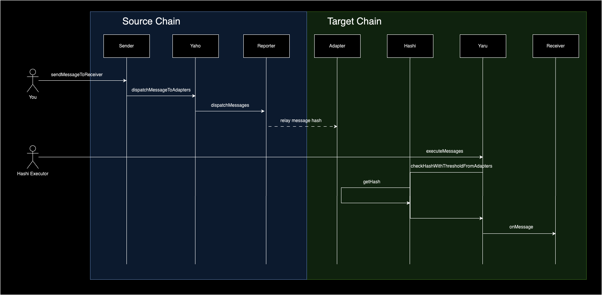
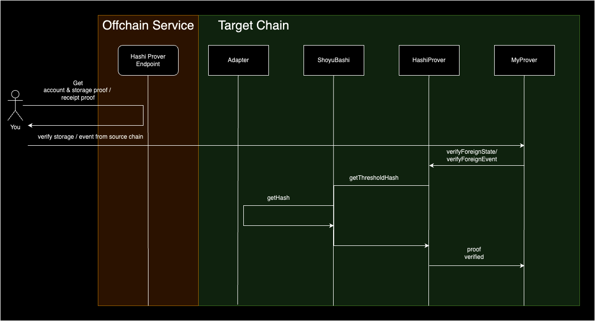

# Hashi template

This repository serves as a template for developers to kickstart a Hashi project using Hardhat/Foundry.

This template includes basic contracts and deployment scripts to set up a Hashi-based project quickly. To follow along, refer to `Quick Start` tutorial in the [Hashi documentation](https://crosschain-alliance.gitbook.io/hashi/getting-started/quick-start).

# Repository architecture

1. `/foundry`: Template using Foundry. Consist of contracts, deploy scripts, and configuration.
2. `/hardhat`: Template using Hardhat. Consist of contracts, deploy scripts, and configuration.
3. `/offchain`: Offchain helper scripts and contract ABI.
4. `/public`: images for illustration purpose.

## Contract Overview

### Message Dispatching

1. `Sender`: contract from source chain that calls `Yaho` to dispatch message on target chain. Developers can define the logic in their sender contract from source chain, i.e. `SepoliaSender.sol`.
2. `Receiver`: contract on target chain that receives callback from `Yaru` and execute further logic is threshold is met by oracles (adapters on target chain). Developers can define the logic in their receiver contract on target chain, i.e. `ChiadoReceiver.sol`.

The end to end workflow of message dispatching

### State Verifying

State verifying contains the logic to verify storage proof and event proof.

1. `HashiProver`: A modified version of [HashiProver.sol](https://github.com/gnosis/hashi/blob/main/packages/evm/contracts/prover/HashiProver.sol), which changes the visibility of `verifyForeignEvent` and `verifyForeignStorage` function to public. Developers can simply pass the contract address into the `MockERC20Prover.sol` constructor. The deployed HashiProver address can be found in [Hashi documentation](https://crosschain-alliance.gitbook.io/hashi/deployments/blockchains#shoyubashi-and-hashi-prover).
2. `MockERC20`: A mock ERC20 contract that is deployed on source chain.
3. `MockERc20Prover`: A mock prover contract against the storage and event from `MockERC20` contract, should be deployed on target chain.

The end to end workflow of state(storage or event) verifying

To learn more about the key contracts in Hashi, check out [Key Contracts in Hashi Documentation](https://crosschain-alliance.gitbook.io/hashi/api-and-smart-contracts/key-contracts).

## Deployment

To get the deployment addresses of Yaho and Yaru, check out [here](https://crosschain-alliance.gitbook.io/hashi/deployments/blockchains). Note that `Yaho` is deployed on source chain, and `Yaru` is deployed on target/destination chain with respect to the source chain.

To get the oracle(reporter & adapter) addresses, check out [here](https://crosschain-alliance.gitbook.io/hashi/deployments/oracles). At the moment, [LayerZero](https://layerzero.network/) covers most of the networks that are supported by Hashi.

To get the Hashi Prover addresses, check out [here](https://crosschain-alliance.gitbook.io/hashi/deployments/blockchains#shoyubashi-and-hashi-prover)

# Reference & Tool

1. Hashi documentation: https://crosschain-alliance.gitbook.io/hashi
2. Hashi repository: https://github.com/gnosis/hashi/
3. Hashi Explorer: https://hashi-explorer.xyz/
